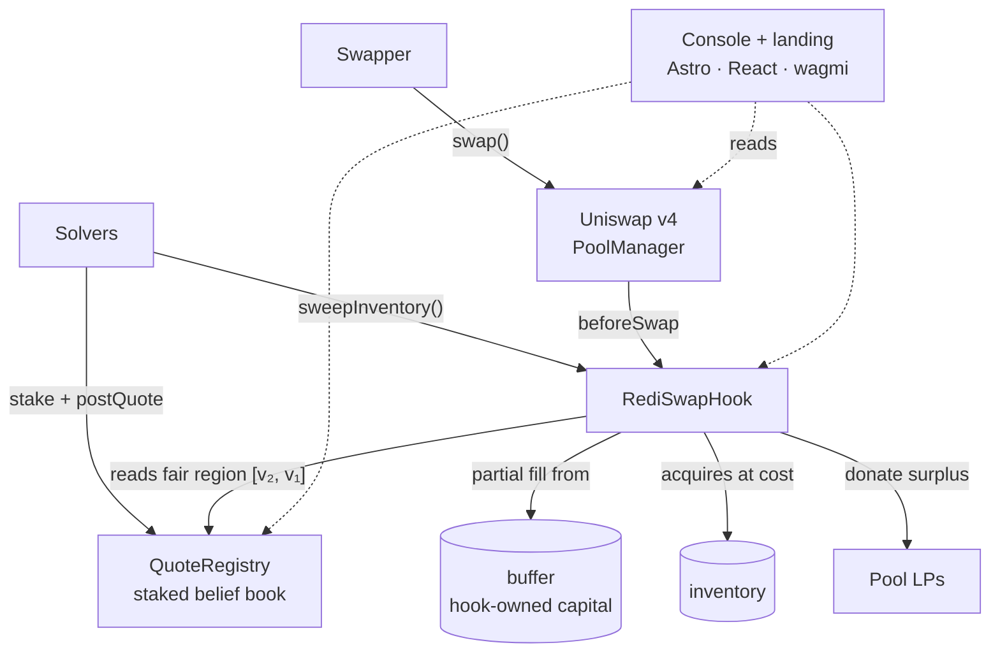

<div align="center">


# Hyberbola

### The Uniswap v4 hook that only steps in to make your fill better.

*When your swap would be filled worse than the market price, the hook fills part of it at a better price — and the arbitrage a bot would have taken goes to you and the LPs instead.*

[](https://docs.uniswap.org/contracts/v4/overview)
[](https://getfoundry.sh)
[](https://soliditylang.org)
[](https://sepolia.uniscan.xyz)
[](https://astro.build)
[](#-tests)
[](#-license)

[**Quickstart**](QUICKSTART.md) · [**Demo runbook**](DEMO.md) · [**Security review**](hyberbola/SECURITY.md)

</div>

---

## What is Hyberbola?

Every swap on a constant-product pool moves the price. When it moves the price *past* what
the competitive market believes the pair is worth, you have been filled at a bad price — and
an arbitrageur will trade right after you to collect the gap. That value came out of your
pocket and the LPs' pockets. Making the trade private doesn't change the fact that the value
exists.

Hyberbola is a Uniswap v4 hook that catches it earlier. Arbitrageurs ("solvers") stake and
post the price they actually believe a pair is worth. The best and runner-up beliefs bracket
a **fair-price region**. On every swap the hook asks one question:

> Is this trade being filled on the wrong side of that region?

- **No** — the swap is moving toward fair, or there are no live beliefs → the hook returns
  nothing and the swap is completely ordinary.
- **Yes** — the hook fills up to a third of the order **itself**, from a hook-owned buffer, at
  a price set between the pool and the runner-up belief. The rest routes to the pool as a
  smaller, lower-impact swap.

The swapper's total output beats the plain pool — **every time the hook acts, guaranteed by
construction** and verified by fuzzing and a 128,000-call invariant. The tokens the hook
acquires are auctioned to solvers, who hedge them externally; the auction proceeds refill the
buffer and the surplus is donated straight to the pool's LPs.

> **Why it matters:** it needs no oracle, no encrypted mempool, and no block-builder
> cooperation. It is one hook that makes the swapper *strictly* better off, hands LPs a slice
> of recaptured arbitrage value, and adds synthetic depth — with its sharpest edge on exactly
> the pools current AMM design serves worst: thin, volatile pairs.

---

## Features

### For the swapper
- **Vanilla-or-better, always.** The hook's fill is priced strictly above the pool, and the
  remainder is a smaller swap with less impact. There is no input for which the hooked
  execution comes out worse than a plain pool. This is structural, not best-effort.
- **Never front-run by the hook.** The hook has no `beforeSwapReturnDelta` path that moves
  price against you. It only ever hands you more output per unit of input.
- **Conditional by design.** A trade that corrects a mispricing is left entirely untouched —
  the full benefit is yours.

### For the LPs
- **Recaptured arbitrage, paid on-chain.** The margin the hook keeps between its acquisition
  price and the runner-up belief is `donate`d to in-range LPs on every intervention — value
  that would otherwise leave the pool entirely.
- **Synthetic depth from hook capital.** The buffer is bootstrap capital, not LP funds at
  risk. It makes a thin pool trade as if it were 30–40% deeper on an away-from-fair swap.
- **A lower fee becomes viable.** Offset the LVR that forces fat fees on volatile pairs and
  the fee no longer has to cover it.

### For the solver
- **No inventory, no custody.** Post a staked price. Capital is committed only for the
  seconds it takes to sweep the hook's inventory after winning — then hedged externally.
- **Second-price truthful.** The hook prices off the *runner-up* belief, never the winner, so
  bidding your honest number is the dominant strategy and one aggressive quote can't drag a
  fill.
- **Atomic hedging.** `sweepInventory` exposes an `ISweepCallback` seam: receive inventory →
  sell it elsewhere → pay from the proceeds, all in one transaction.

### The console
- **Landing** — a scroll-driven derivation of the mechanism, from `x·y = k` to the LP
  donation, rendered as live KaTeX with figures.
- **Swap** — enter a trade, watch the hook's decision, the partial fill, and hooked-vs-vanilla
  output, then send it.
- **Positions** — faucet, stake & quote, and the hook's live `buffer` / `inventory` / `spent`
  ledger.
- **Transactions** — `preview` the beforeSwap decision for any trade, and run the
  permissionless `sweepInventory`.
- **Pools** — point the console at any deployment; the Unichain Sepolia stack loads by
  default.

---

## 🏛️ Architecture

Two deploys, one mechanism. The console is a static Astro site; everything with authority
lives in two immutable contracts on Unichain.



| Component | Role | Where |
|-----------|------|-------|
| **RediSwapHook** | Conditional partial-fill counterparty + inventory auction | Unichain Sepolia |
| **QuoteRegistry** | Staked belief book — ranks beliefs, returns winner + runner-up | Unichain Sepolia |
| **RediSwapMath** | Potential function `φ(x,y,v) = xv + y − 2√(kv)` and trade value `Δφ` | library |
| **Console** | Landing + 4-tab developer console | `web/` · Astro static |

---

## How the hook works

```
swap ─▶ beforeSwap: is the fill on the wrong side of [v₂, v₁]? ──no──▶ ordinary swap
                              │ yes
                              ▼
         fill ≤ MAX_FILL_BPS of the order from buffer,
         priced at  hookPx = poolPx + (1−e)·(v₂ − poolPx)      ──▶  swapper gets ≥ vanilla
                              │
                inventory accrues, cost basis tracked in `spent`
                              ▼
         sweepInventory ─▶ solver pays inv·v₂ (floored at pool spot), hedges externally
                              │
              buffer refilled to cost ──┴──▶  surplus donated to in-range LPs
```

### Worked example

Pool at **1.00**. You sell **1,000 USDC → DAI**. Live beliefs: `1.05`, `1.02` (runner-up), `0.99`.

| step | what happens |
|---|---|
| **trigger** | you push price down, away from the `[1.02, 1.05]` region → the hook acts |
| **price** | `hookPx = 1.00 + 0.8·(1.02 − 1.00) = 1.016` — better than the pool, 20% margin under `v₂` |
| **fill** | hook takes **300 USDC**, pays **304.8 DAI** from buffer; remaining **700 USDC** hits the pool → ~697 DAI |
| **you get** | **≈ 1,001.8 DAI** — vs **≈ 992 DAI** on a plain pool |
| **later** | a solver sweeps 300 USDC at `1.02` → pays 306 DAI, hedges externally |
| **settle** | 304.8 DAI refills the buffer, **1.2 DAI donated to LPs** |

| party | plain pool | this hook |
|---|---|---|
| swapper | ~992 DAI | **~1,001.8 DAI** |
| LPs | swap fee | swap fee **+ 1.2 DAI** |
| solver | keeps the entire mispricing | keeps only `v₁ − v₂` → 0 with competition |
| pool price | pushed down, left stale | barely moved |

### Where the capital comes from

The hook **fronts** the fill from its own buffer — for about a minute — then an arbitrageur
buys the position back and makes it whole.

```
1. swap        buffer[DAI] −304.8   →  you   (the hook pays your fill from its own capital)
               inventory[USDC] +300     (the hook is now long 300 USDC it slightly overpaid for)

2. sweep       solver → hook  +306 DAI   (an arbitrageur buys the inventory at v₂ = 1.02)
               buffer[DAI]  +304.8       (restored to exactly where it started)
               donate → LPs  +1.2        (the surplus)
```

So the hook's capital is exposed only between the swap and the sweep. The value being split
isn't a subsidy from the buffer — it's the **arbitrage gap that would otherwise have gone
entirely to a backrunning bot.** In a plain pool that bot keeps 100% of it; here it becomes:

```
the arbitrage gap  →  a slice to the swapper   (a better fill, up front)
                   →  a slice to the LPs        (the on-chain donation)
                   →  the rest to the sweeping solver  (v₁ − v₂, → 0 with competition)
```

The buffer only ever buys inventory **below** the competitive belief, and the sweep restores
it. The real exposure is adverse selection: if the posted beliefs are stale and the market
genuinely moved, the hook can be left holding inventory no solver wants (the sweep reverts
when `proceeds ≤ cost`) and the buffer stays depleted until the price recovers or someone
tops it up — which is why it is **bootstrap capital**, `MIN_STAKE` is a slashing bond and
never working capital, and a TWAP floor on the sweep price is a
[known open item](hyberbola/SECURITY.md).

### Parameters, as deployed

| | value | meaning |
|---|---|---|
| `MAX_FILL_BPS` | **3000** | largest share of an order filled from buffer |
| `HOOK_EDGE_BPS` | **2000** | margin kept below `v₂` → donated to LPs |
| `MIN_STAKE` | **0.1 ETH** | solver bond — sybil cost, never working capital |
| `MAX_QUOTE_DURATION` | **5 min** | belief lifetime; stale prices expire themselves |
| hook permissions | `beforeSwap` · `beforeSwapReturnDelta` | the two flags mined into the hook address |

---

## Contracts

| Contract | Purpose | Runtime size |
|----------|---------|-------------|
| [`RediSwapHook.sol`](hyberbola/src/RediSwapHook.sol) | `beforeSwap` decision, partial fill via `BeforeSwapDelta`, `sweepInventory` auction with spot-floored pricing, LP donation, `nonReentrant` throughout | **8,587 B** |
| [`QuoteRegistry.sol`](hyberbola/src/QuoteRegistry.sol) | `stake` / `postQuote` / `withdrawQuote`; `bestForXForY` & `bestForYForX` return winner + runner-up; expiry + stake checks | 3,053 B |
| [`libraries/RediSwapMath.sol`](hyberbola/src/libraries/RediSwapMath.sol) | `potentialValueWad`, `tradeValueWad`, `limitState` — the RediSwap potential mechanism in wad | — |

Solidity `0.8.26`, `via_ir`, EVM `cancun`. Both contracts are immutable — no admin, no owner,
no upgrade path.

---

## 🧪 Tests

```bash
cd hyberbola && forge test
```

**33 tests, 0 failing.**

| Suite | Tests | What it proves |
|-------|-------|----------------|
| [`RediSwapHook.t.sol`](hyberbola/test/RediSwapHook.t.sol) | 8 (2 fuzz) | `testFuzz_swapperVanillaOrBetter` — hooked output ≥ plain pool across 256 random size/belief/direction combos · `test_towardFair_notIntervened` — a fill moving toward fair is byte-identical to the plain pool · `test_awayFromFair_swapperBeatsVanilla` — 992 → 1001.8 DAI · both swap directions · `test_sweep_refillsBufferAndClears` · `testFuzz_hookSolvent` |
| [`RediSwapHookInvariants.t.sol`](hyberbola/test/RediSwapHookInvariants.t.sol) | 2 invariants · **128,000 calls each · 0 reverts** | `invariant_hookSolvent` — the hook always physically holds ≥ `buffer + inventory` in both currencies through arbitrary sequences of swaps, sweeps, funding and re-quotes · `invariant_costBasisTracksInventory` — `spent` is never orphaned from `inventory` |
| [`QuoteRegistry.t.sol`](hyberbola/test/QuoteRegistry.t.sol) | 13 (2 fuzz) | `testFuzz_bestForXForY_matchesBruteForce` / `…YForX` — the O(n) ranking matches a brute-force winner+runner-up over 256 random 5-quoter books · staking, unstaking below `MIN_STAKE`, expiry exclusion, quote overwrite/withdraw |
| [`RediSwapMath.t.sol`](hyberbola/test/RediSwapMath.t.sol) | 10 | `φ` potential at the initial state, `Δφ` trade value for one and two arbitrageurs, `maxMEV` ceiling, the limit-state quadratic across three transactions |

Selected gas: `beforeSwap` intervention path `test_awayFromFair` **621k** end-to-end (swap +
plain-pool comparison + assertions); `sweepInventory` full cycle **555k**; a non-intervening
swap adds ~a plain swap's overhead.

---

## 🚀 Deployment — Unichain Sepolia (chain `1301`)

| | address |
|---|---|
| **RediSwapHook** | [`0xB9C04898F52398940Dfe5923d1d868edE4238088`](https://sepolia.uniscan.xyz/address/0xB9C04898F52398940Dfe5923d1d868edE4238088) |
| **QuoteRegistry** | [`0x91A563B7d85892993214CAd4C289f85f376F2273`](https://sepolia.uniscan.xyz/address/0x91A563B7d85892993214CAd4C289f85f376F2273) |
| PoolManager (Uniswap) | `0x00B036B58a818B1BC34d502D3fE730Db729e62AC` |
| Currency0 (Test USDC) | `0x6038835cC4312CEc700006451E4f95Cd9E7326aB` |
| Currency1 (Test DAI) | `0xB33Dc012a2fb318992c076A67F88B50Da9E18286` |
| Pool id | `0xfca21fb9e8d4c0e372a4f46e57b970b2772466145c4daa5de918bbd5d10507df` |
| Fee / tick spacing | `3000` / `60` |

Buffer seeded with **25,000** of each currency. The console at `web/` loads this stack by
default — see [**QUICKSTART.md**](QUICKSTART.md).

---

## 🔒 Security & trust

- Both contracts are **immutable** — no proxy, no admin, no owner, no pause.
- Every hook callback verifies `msg.sender == poolManager`. `fundBuffer` and `sweepInventory`
  are `nonReentrant`, and all state is zeroed before any token transfer or callback.
- The v4 delta accounting is proven to net to zero by the 128,000-call `invariant_hookSolvent`.
- `sweepInventory` floors its price at the pool spot, so a solver can never buy the hook's
  inventory below the pool's own rate.
- `beforeSwapReturnDelta` is the highest-risk v4 permission. Its use here only ever returns
  *more output per input* — it structurally cannot take a swapper's funds. A full self-review,
  including the residual items before a production deployment, is in
  [`hyberbola/SECURITY.md`](hyberbola/SECURITY.md). **Not yet third-party audited** — treat as
  a research deployment on testnet.

---

## 📚 References

### RediSwap — the mechanism this is built on

**RediSwap: MEV Redistribution Mechanism for CFMMs** — Mengqian Zhang, Sen Yang, Fan Zhang
(Yale University). [arXiv:2410.18434](https://arxiv.org/abs/2410.18434) (Oct 2024); published at
the 2025 ACM Workshop on Decentralized Finance and Security
([ACM DL](https://dl.acm.org/doi/10.1145/3733815.3764044)).

RediSwap is a full AMM design: it collects every arbitrageur's reported price belief, runs a
dominant-strategy-incentive-compatible auction, and then **sequences transactions and inserts the
MEV trades itself** on behalf of the winning arbitrageur, refunding the proceeds to users and LPs.
The paper proves the mechanism is individually rational and Sybil-proof, beats UniswapX execution
on 89% of trades, and cuts LP loss to under 0.5% of the original LVR.

**What Hyberbola takes from it:**

| From the paper | Where it lives | How it's used |
|---|---|---|
| Potential function `φ(x, y, v) = xv + y − 2√(kv)` | `RediSwapMath.potentialValueWad` | scores how far the pool sits from a belief price `v` |
| Per-trade value `Δφ = Δx·v + Δy` | `RediSwapMath.tradeValueWad` | the arbitrageur's bid — what a trade is worth at belief `v` |
| Second-price auction over belief prices | `QuoteRegistry.bestForXForY` / `bestForYForX` return winner **and runner-up**; the hook prices and settles at the runner-up `v₂` | truthful bidding stays dominant; one aggressive quote can't move the fill |
| Refund the recaptured value to users + LPs | `beforeSwap` partial fill (to the swapper) + `sweepInventory` `donate` (to LPs) | the redistribution target |

**What Hyberbola changes — and why:**

- **No transaction sequencing.** RediSwap needs to order transactions and inject MEV trades,
  which requires builder cooperation or a proposer-side mechanism. Hyberbola runs entirely inside
  a single `beforeSwap` callback on an ordinary v4 pool — nothing to bootstrap.
- **Conditional, partial intervention.** RediSwap manages the whole arbitrage opportunity.
  Hyberbola only acts when the swap pushes price to the *wrong side* of the belief region, and
  only fills up to `MAX_FILL_BPS` (30%) of the order. The rest is an ordinary pool swap.
- **A structural vanilla-or-better floor.** The fill is priced strictly between the pool and
  `v₂`, so the swapper's total output is provably ≥ a plain pool on every touched trade — checked
  by fuzzing and a 128,000-call invariant. This is a design constraint Hyberbola adds on top.
- **The arbitrageur commits no capital until they win.** Solvers post a staked price; capital
  is only committed for the seconds it takes to sweep the hook's inventory.

So Hyberbola is best read as *a deployable v4-hook adaptation of RediSwap's redistribution idea*,
trading the paper's optimal capture for something you can ship on a pool today with a hard
swapper guarantee.

### Other

- **Automated Market Making and Loss-Versus-Rebalancing** — Milionis, Moallemi, Roughgarden,
  Wang. [arXiv:2208.06046](https://arxiv.org/abs/2208.06046) (2022). The LVR the sweep-donation
  path is meant to offset.
- [Uniswap v4 core](https://github.com/Uniswap/v4-core) · [v4 hooks concepts](https://docs.uniswap.org/contracts/v4/concepts/hooks)

---

## 📄 License

Released under the **MIT License**.

<div align="center">
<sub>A Uniswap v4 hook · <a href="https://getfoundry.sh">Foundry</a> · <a href="https://astro.build">Astro</a></sub>
</div>
